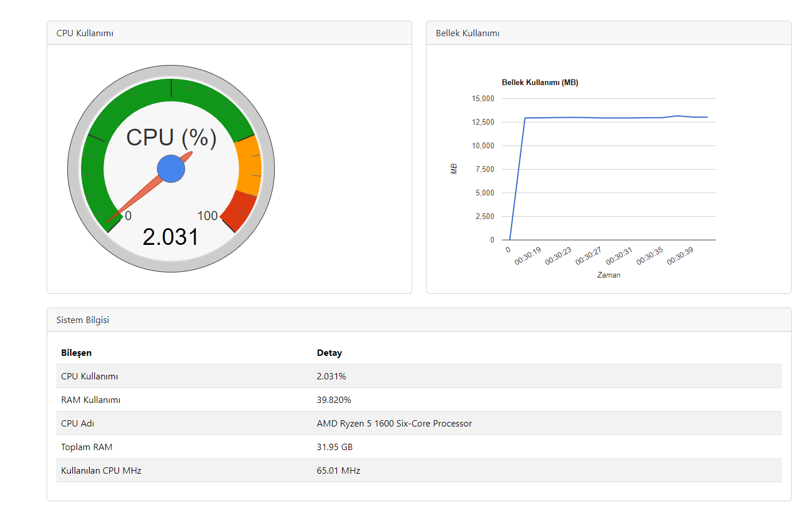

# CPU ve Bellek İzleyici

Bu proje, gerçek zamanlı olarak CPU ve bellek kullanımını izleyen bir uygulamadır. CPU hızını ve bellek kullanımını grafikler ve tablo aracılığıyla gösterir. Proje, Go dili ile yazılmış backend ve HTML ile ön yüzü içerir. Google Charts kütüphanesi grafikler için kullanılmıştır.

## Özellikler

- CPU kullanımını ve MHz hızını gerçek zamanlı olarak gösterebilen gauge grafikleri.
- Bellek kullanımını zamana bağlı olarak gösteren çizgi grafiği.
- Sistem bilgilerini tablo şeklinde gösterir: CPU kullanım yüzdesi, RAM kullanımı, CPU adı, toplam RAM ve kullanılan CPU MHz.

## Kurulum

### Başlangıç

1. **Go Paketlerini Kurma**

   GitHub'dan gerekli Go paketlerini yüklemek için terminalde şu komutları çalıştırın:

   ```bash
   go get github.com/shirou/gopsutil/cpu
   go get github.com/shirou/gopsutil/mem

2. **Projeyi Klonla & Çalıştır**
     ```bash
     git clone https://github.com/iatila/Cpu_Memory_Usage.git
     cd Cpu_Memory_Usage
     go run main.go
